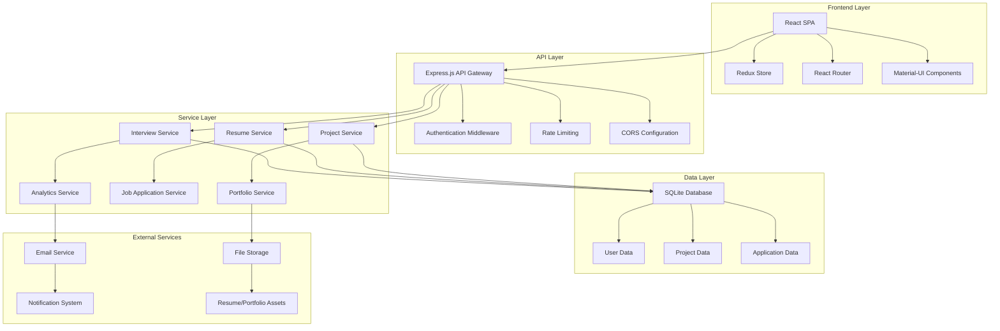

# Design Document

## Overview

The Career Transition Portfolio system is a full-stack web application built with modern technologies to provide a comprehensive career management platform. The system uses a microservices-inspired modular architecture with a React frontend, Node.js/Express backend, and SQLite database. The design emphasizes user experience, real-time updates, and scalability to support multiple users while maintaining fast performance.

## Architecture

### High-Level Architecture



### Technology Stack

**Frontend:**
- React 18 with TypeScript for type safety and modern development
- Redux Toolkit for state management
- React Router v6 for client-side routing
- Material-UI (MUI) for consistent, professional UI components
- Axios for API communication
- Chart.js for progress visualization

**Backend:**
- Node.js with Express.js framework
- TypeScript for type safety across the stack
- JWT for authentication and authorization
- Bcrypt for password hashing
- Multer for file upload handling
- Node-cron for scheduled tasks and notifications

**Database:**
- SQLite for relational data with ACID compliance
- Prisma ORM for type-safe database operations
- Redis for session management and caching

**Infrastructure:**
- Docker for containerization
- Nginx for reverse proxy and static file serving
- PM2 for process management
- Winston for structured logging

## Components and Interfaces

### Core Modules

#### 1. Project Management Module
**Purpose:** Handle portfolio project creation, tracking, and completion

**Key Components:**
- `ProjectController`: REST endpoints for CRUD operations
- `ProjectService`: Business logic for project lifecycle management
- `TimeTracker`: Component for monitoring project deadlines
- `ProgressCalculator`: Utility for computing completion percentages

**API Endpoints:**
```typescript
POST /api/projects - Create new project
GET /api/projects - List user projects
PUT /api/projects/:id - Update project details
DELETE /api/projects/:id - Remove project
POST /api/projects/:id/complete - Mark project complete
GET /api/projects/:id/progress - Get detailed progress data
```

#### 2. Resume Management Module
**Purpose:** Generate, customize, and export professional resumes

**Key Components:**
- `ResumeBuilder`: Service for dynamic resume generation
- `TemplateEngine`: Multiple resume format templates
- `ExportService`: PDF/Word/Text export functionality
- `VersionControl`: Track resume versions per application

**API Endpoints:**
```typescript
POST /api/resumes - Create resume version
GET /api/resumes - List user resume versions
PUT /api/resumes/:id - Update resume content
POST /api/resumes/:id/export - Export in specified format
GET /api/resumes/templates - Available resume templates
```

#### 3. Job Application Tracking Module
**Purpose:** Manage job applications, status updates, and follow-ups

**Key Components:**
- `ApplicationTracker`: CRUD operations for job applications
- `StatusManager`: Handle application status transitions
- `FollowUpScheduler`: Automated follow-up reminders
- `CompanyResearch`: Store and organize company information

**API Endpoints:**
```typescript
POST /api/applications - Submit new application
GET /api/applications - List applications with filters
PUT /api/applications/:id/status - Update application status
POST /api/applications/:id/notes - Add application notes
GET /api/applications/analytics - Application success metrics
```

#### 4. Interview Preparation Module
**Purpose:** Organize interview scheduling, preparation, and feedback

**Key Components:**
- `InterviewScheduler`: Calendar integration and scheduling
- `PreparationGuide`: Company-specific prep materials
- `QuestionBank`: Technical and behavioral question database
- `FeedbackCollector`: Post-interview analysis and improvement

**API Endpoints:**
```typescript
POST /api/interviews - Schedule new interview
GET /api/interviews - List upcoming/past interviews
PUT /api/interviews/:id - Update interview details
POST /api/interviews/:id/feedback - Record interview feedback
GET /api/interviews/preparation/:companyId - Get prep materials
```

#### 5. Portfolio Showcase Module
**Purpose:** Generate professional portfolio presentations

**Key Components:**
- `PortfolioGenerator`: Create showcase pages from project data
- `AssetManager`: Handle images, demos, and documentation
- `SEOOptimizer`: Meta tags and search optimization
- `AnalyticsTracker`: Portfolio view and engagement metrics

**API Endpoints:**
```typescript
GET /api/portfolio/:userId - Public portfolio view
POST /api/portfolio/generate - Regenerate portfolio
PUT /api/portfolio/settings - Update portfolio configuration
GET /api/portfolio/analytics - Portfolio performance data
```

## Data Models

### User Model
```typescript
interface User {
  id: string;
  email: string;
  passwordHash: string;
  firstName: string;
  lastName: string;
  targetJobTitle: string;
  jobSearchDeadline: Date;
  createdAt: Date;
  updatedAt: Date;
}
```

### Project Model
```typescript
interface Project {
  id: string;
  userId: string;
  title: string;
  description: string;
  techStack: string[];
  startDate: Date;
  targetEndDate: Date;
  actualEndDate?: Date;
  status: 'planning' | 'in-progress' | 'completed' | 'paused';
  repositoryUrl?: string;
  liveUrl?: string;
  revenueTracking: boolean;
  marketResearch?: string;
  createdAt: Date;
  updatedAt: Date;
}
```

### JobApplication Model
```typescript
interface JobApplication {
  id: string;
  userId: string;
  companyName: string;
  jobTitle: string;
  jobUrl: string;
  applicationDate: Date;
  status: 'applied' | 'screening' | 'interview' | 'offer' | 'rejected' | 'withdrawn';
  resumeVersionId: string;
  coverLetter?: string;
  notes: string;
  followUpDate?: Date;
  createdAt: Date;
  updatedAt: Date;
}
```

### Interview Model
```typescript
interface Interview {
  id: string;
  applicationId: string;
  interviewType: 'phone' | 'video' | 'onsite' | 'technical';
  scheduledDate: Date;
  duration: number;
  interviewerName?: string;
  preparationNotes: string;
  questionsAsked: string[];
  feedback?: string;
  outcome: 'pending' | 'passed' | 'failed' | 'cancelled';
  createdAt: Date;
  updatedAt: Date;
}
```

### Resume Model
```typescript
interface Resume {
  id: string;
  userId: string;
  versionName: string;
  templateId: string;
  content: {
    personalInfo: PersonalInfo;
    summary: string;
    experience: Experience[];
    projects: ProjectSummary[];
    skills: string[];
    education: Education[];
  };
  isDefault: boolean;
  createdAt: Date;
  updatedAt: Date;
}
```

## Error Handling

### Error Response Format
```typescript
interface ErrorResponse {
  success: false;
  error: {
    code: string;
    message: string;
    details?: any;
    timestamp: string;
  };
}
```

### Error Categories

**Validation Errors (400):**
- Invalid input data format
- Missing required fields
- Business rule violations

**Authentication Errors (401):**
- Invalid credentials
- Expired JWT tokens
- Missing authentication headers

**Authorization Errors (403):**
- Insufficient permissions
- Resource access denied

**Not Found Errors (404):**
- Resource does not exist
- Invalid endpoint

**Server Errors (500):**
- Database connection failures
- External service unavailable
- Unexpected application errors

### Error Handling Strategy

1. **Input Validation:** Use Joi schemas for request validation
2. **Global Error Handler:** Centralized error processing middleware
3. **Logging:** Structured error logging with Winston
4. **User Feedback:** Clear, actionable error messages
5. **Retry Logic:** Automatic retry for transient failures
6. **Circuit Breaker:** Prevent cascade failures with external services

## Testing Strategy

### Unit Testing
- **Framework:** Jest with TypeScript support
- **Coverage Target:** 80% code coverage minimum
- **Focus Areas:** Business logic, utility functions, data transformations
- **Mocking:** Database operations, external API calls

### Integration Testing
- **Framework:** Supertest for API endpoint testing
- **Database:** Test database with Docker containers
- **Scenarios:** End-to-end user workflows, data consistency

### Frontend Testing
- **Framework:** React Testing Library with Jest
- **Component Testing:** User interactions, state management
- **E2E Testing:** Cypress for critical user journeys

### Performance Testing
- **Load Testing:** Artillery.js for API performance
- **Database Performance:** Query optimization and indexing
- **Frontend Performance:** Lighthouse CI for web vitals

### Testing Automation
- **CI/CD Pipeline:** GitHub Actions for automated testing
- **Pre-commit Hooks:** Lint, format, and test validation
- **Deployment Testing:** Staging environment validation

### Test Data Management
- **Fixtures:** Consistent test data sets
- **Factories:** Dynamic test data generation
- **Cleanup:** Automated test data cleanup between runs